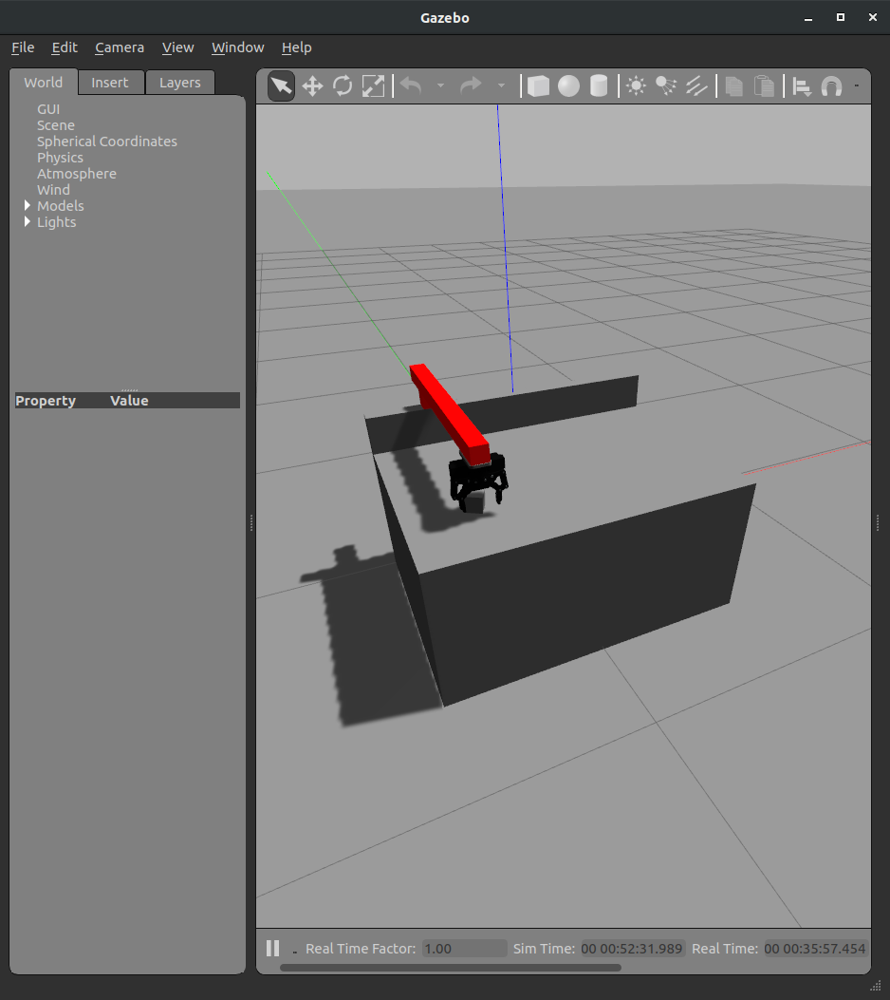

# 2-finger custom robot

## This package contains a custom robot moving in 2D with a 2-finger gripper for some tests.

Dependencies:

- [Gazebo MimicJointPlugin](https://github.com/roboticsgroup/roboticsgroup_upatras_gazebo_plugins)
- [Gazebo contact_republisher](https://github.com/wonwon0/gazebo_contact_republisher)
